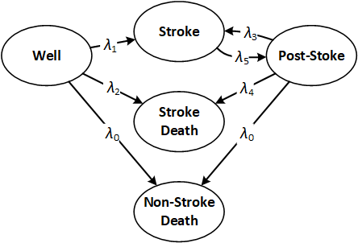

# Homework Assignment 5

**Overview**. We would like to use a continuous-time Markov model to make our stroke model more realistic. 
Ideally, we would use the data from the recent American Heart Association report 
[“Heart Disease and Stroke Statistics—2018 Update”](https://www.ahajournals.org/doi/full/10.1161/CIR.0000000000000558)
 [Benjamin E. et al. Circulation. 2018; 137] 
for this purpose but to keep things simple, we are going to use some rough estimates from this report.

**Problem 1: Building Transition Rate Matrix (Weight 6)**. 
Follow the steps below to calculate the transition rate matrix when anticoagulation is not used. 

- **Part 1**: Find the rate of background (non-stroke associated) mortality event (λ0) based on 
the following estimates:  
    - The annual mortality rate due to all causes is 18 per 1,000 population (of age 65 and older). 
    - The annual rate of stroke-associated death is 36.2 per 100,000 population (of age 65 and older)    
    _Hint_: The non-stroke associated annual mortality rate is therefore 
    18*100 - 36.2 per 100,000 population (of age 65 and older). 

- **Part 2**: Assume that the annual rate of first-ever stroke is 15 per 1,000 population 
(of age 65 and older). 
Calculate the annual rate of first stroke events for our population. 
While data suggest that this rate changes with age, to simply our model, 
we assume that this rate remains constant as out patients ages.

- **Part 3**: Among patients who experience stoke, 75% survives (and move to “Stoke” state) 
and 25% dies (and move to “Stroke Death”). Use these probabilities and the annual rate you calculated in Part 2, 
to find the annual rate of transition from state “Well” to “Stroke” and to “Stroke Death”.
_Hint_: What you estimated in Part 2 is λ1+λ2 (the rate at which strokes occur). 
Therefore, if someone moves out of “Well” due to stroke, he or she will move to “Stroke” with the 
probability λ1/(λ1+λ2) and move to “Stroke Death” 
with probability λ2/(λ1+λ2).

- **Part 4**: In our population, the proportion of patients with recurrent stroke in 5 years 
after first stroke is 17%. Use this number to calculate the annual rate of recurrent stroke events.  

- **Part 5**: Assume that the probability of surviving a recurrent stroke is 70%. 
Follow the procedure in Part 3, to calculate the annual transition rates from state 
“Post-Stroke” to “Stroke” and “Stroke Death” (i.e. λ3 and λ4). 

- **Part 6**: A patient who survives a stroke stays in state “Stroke” on average 1 week. 
Calculate the annual rate of transition from “Stroke” to “Post-Stroke” (λ5). 
Remember we have been using year as the unit of time. 
_Hint_: If the transition rate out of a state is λ, the expected stay time in the state is 1/λ. 

**Problem 2: Transition Matrix Under Anticoagulation Use (Weight 2)**. 
Find the transition rate matrix when anticoagulation is used. 
Note that only individuals in the “Post-Stroke” state require 
treatment with anticoagulation. Assume that the anticoagulation reduces the rate of 
stroke events while in “Post-Stroke” 
by 45% but increases the rate of non-stroke related mortality by 5%.

**Problem 3: Simulation (Weight 4)**. Use Monte Carlo to simulate 2000 patients. 
For each alternative, produce survival curves an the histograms of number of stokes, and report 
the average survival time and the average lifetime number of stokes.  
